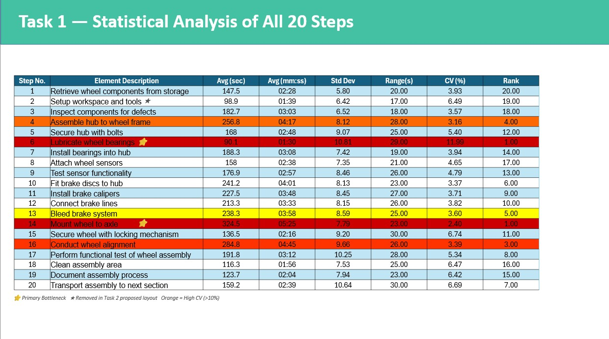
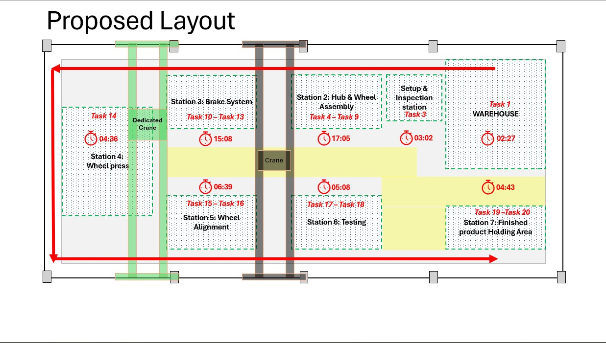

# Siemens Mobility — Wheel Assembly Bottleneck Analysis
**Forage Job Simulation | Operations Industrial Engineering**

---

## Overview
Time study analysis of a 20-step rail vehicle wheel assembly process 
for the **Aurora Express** project at Siemens Mobility. The objective 
was to identify bottlenecks, quantify process variability, and propose 
data-driven lean manufacturing improvements.

---

## Time Study Analysis — All 20 Steps

---

## Key Findings

| Metric | Value |
|---|---|
| Total Steps Analysed | 20 |
| Observations per Step | 10 |
| Baseline Cycle Time | 62:04 min |
| Primary Bottleneck | Step 14 — Mount Wheel to Axle (avg 5:25, Rank 1) |
| Highest Variability | Step 6 — Lubricate Bearings (CV = 11.99%, Rank 1) |
| Projected Cycle Time | 58:48 min |
| Total Time Saved | ~196 seconds (5.3% reduction) |

---

## Proposed Floor Layout — 7-Station Design

The redesigned layout introduces a **7-station flow** with a dedicated 
crane rail, eliminating equipment queue time — the root cause of the 
primary bottleneck (Step 14).

| Station | Tasks | Time |
|---|---|---|
| Warehouse | Task 1 | 02:27 |
| Setup & Inspection | Task 3 | 03:02 |
| Station 2: Hub & Wheel Assembly | Tasks 4–9 | 17:05 |
| Station 3: Brake System | Tasks 10–13 | 15:08 |
| Station 4: Wheel Press | Task 14 | 04:36 |
| Station 5: Wheel Alignment | Tasks 15–16 | 06:39 |
| Station 6: Testing | Tasks 17–18 | 05:08 |
| Station 7: Finished Product Holding | Tasks 19–20 | 04:43 |
| **Total** | | **58:48** |

---

## Methods & Tools Applied

- Time study methodology (avg, std dev, range, CV across 10 obs/step)
- Statistical Process Control (SPC) — CV threshold analysis (>10% = high instability)
- Root cause analysis — separating structural vs operator-dependent delays
- Lean manufacturing — dedicated crane station, laser alignment, calibrated tooling, SOPs
- Floor layout redesign — 7-station optimised flow
- Excel — statistical analysis, conditional formatting, composite scoring

---

## Files in This Repository

| File | Description |
|---|---|
| `Task_1_Time_Study_Analysis.xlsx` | Raw data + full statistical analysis |
| `Task_2_Proposal_Template.pptx` | Improvement proposal presentation |
| `Bottlenecks_Identified.jpg` | Statistical analysis table — all 20 steps |
| `Proposed_Layout.jpg` | Redesigned 7-station floor layout |

---

## Key References
- Hopp & Spearman — *Factory Physics* (2011)
- Montgomery — *Introduction to Statistical Quality Control* (2009)
- Lathashankar et al. (2018) · Malik et al. (2011) · Shayea et al. (2011)
- Kumar & Kumar (2014) · Mishra (2015) · Antil & Budhiraja (2013)

---

*Completed as part of the Siemens Mobility Operations Industrial Engineer 
Job Simulation on Forage.*
